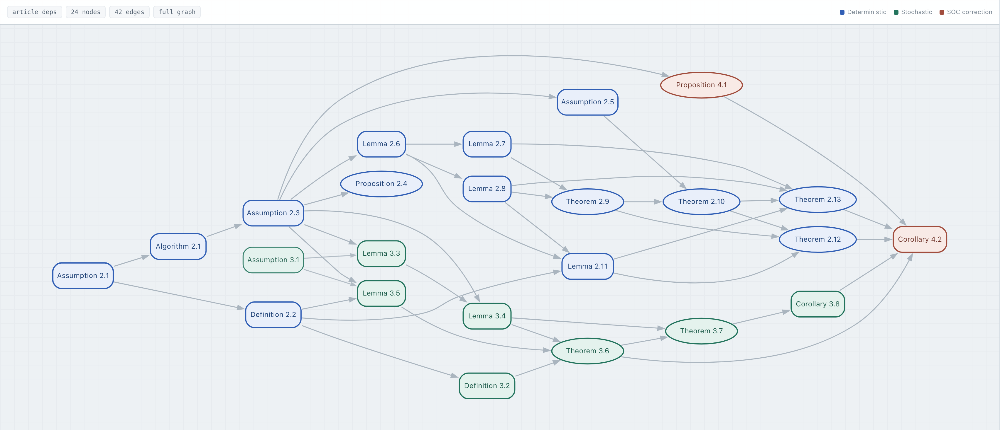

https://github.com/user-attachments/assets/c60f1898-a030-4a73-a407-6091366adfdd

# NR-LALM: reproducible numerical experiments and formal verification

This repository accompanies the paper

*A Fixed-Penalty Linearized Augmented Lagrangian Method with Classical
Multiplier Updates*.

Alacaoglu and Wright highlighted an important open problem: for deterministic
nonconvex programs with nonlinear constraints, establish the best-known
$\mathcal O(\bar{\varepsilon}^{-3})$ complexity for an augmented Lagrangian
method using large dual step sizes and a constant penalty that is independent
of the target accuracy $\varepsilon$. In the smooth nonlinear
equality-constrained setting considered here, NR-LALM answers this question
within a linearized primal framework. It retains the classical multiplier
update and, with a fixed, accuracy-independent penalty, attains
$\mathcal O(\varepsilon^{-2})$ iteration and first-order-oracle complexity.

This repository contains the code needed to reproduce the numerical
experiments in Sections 5.1--5.3. The theoretical results in the paper have
also been formally verified in Lean 4.

Numerical code:
https://github.com/bqliu815/NR-LALM

Lean formalization:
https://github.com/optpku/ReasBook/tree/v4.32.2/ReasBook/Papers/TR_LALM_theory

Complete project on ReasLab:
https://reaslab.io/share/w58YAU-8Rh-x_M7Xshn5WwR6df839.MTc.YWxs

The ReasLab project contains the LaTeX manuscript, the Python numerical
experiments, and the Lean formalization.

## Repository contents

| Paper part | Directory | Paper-facing output |
|---|---|---|
| Section 5.1 | `experiments/section_5_1_mechanism` | mechanism-verification figure |
| Section 5.2 | `experiments/section_5_2_deterministic` | 15-data-set timing table |
| Section 5.3 | `experiments/section_5_3_stochastic` | two-panel mean squared KKT figure |

The paper names are used throughout: **NR-LALM** is the base method and
**NR-LALM+SOC** is its second-order-correction variant.

## Installation

Python 3.11 or newer is recommended.

```bash
python3 -m venv .venv
source .venv/bin/activate
python -m pip install --upgrade pip
python -m pip install -e ".[test]"
pytest
python scripts/validate_release.py
```

IPOPT is used only in Section 5.2. Reproducing the complete four-method table
requires IPOPT 3.14.19 with its PardisoMKL interface linked to Intel oneAPI
Math Kernel Library 2025.3.0, together with `cyipopt` 1.6.1. Install that
system solver stack first and then install the optional Python binding with
`python -m pip install -e ".[ipopt]"`. The other experiments and all
non-IPOPT unit tests do not require it.

## Reproducing the numerical experiments

Section 5.1 is self-contained:

```bash
python experiments/section_5_1_mechanism/scripts/run_mechanism_verification.py \
  --config experiments/section_5_1_mechanism/configs/paper_v1.toml \
  --output-dir experiments/section_5_1_mechanism/results/paper_run
```

Sections 5.2 and 5.3 use public LIBSVM data and are intended for a CPU
cluster. Their own READMEs give the exact download, array-job, aggregation,
and rendering commands. Section 5.2 downloads several very large official
archives before forming deterministic 20,000-row samples; check storage and
network quotas first.

See [docs/REPRODUCIBILITY.md](docs/REPRODUCIBILITY.md) for the complete mapping
from commands to paper artifacts.

## Formal verification

The theoretical results in the paper have been formally verified in Lean 4.
The formalization is pinned to ReasBook `v4.32.2`.

The theorem map is shown below. Click the image to open the interactive version.

[](https://optpku.github.io/ReasBook/theorem-maps/papers/tr_lalm_theory/)

Interactive theorem map:
https://optpku.github.io/ReasBook/theorem-maps/papers/tr_lalm_theory/

A short walkthrough shows how to compare a manuscript statement with its Lean
formalization, navigate definitions in ReasLab, and inspect a Quokka-generated
Lean project:

https://github.com/user-attachments/assets/c60f1898-a030-4a73-a407-6091366adfdd

The formalization can be accessed and checked in either of two ways.

1. **Download the pinned ReasBook source and check it locally.** The following
   sparse checkout downloads the paper-specific source together with the shared
   Lean project files:

```bash
git clone --depth 1 --filter=blob:none --no-checkout --single-branch \
  --branch v4.32.2 https://github.com/optpku/ReasBook.git
cd ReasBook
git sparse-checkout init --no-cone
git sparse-checkout set \
  '/ReasBook/lakefile.lean' \
  '/ReasBook/lean-toolchain' \
  '/ReasBook/lake-manifest.json' \
  '/ReasBook/Papers/TR_LALM_theory.lean' \
  '/ReasBook/Papers/TR_LALM_theory/**'
git checkout v4.32.2
cd ReasBook
lake exe cache get
lake env lean Papers/TR_LALM_theory/Paper.lean
```

2. **Open the complete project directly in ReasLab.**

   https://reaslab.io/share/w58YAU-8Rh-x_M7Xshn5WwR6df839.MTc.YWxs

   The browser project contains the LaTeX manuscript, the Python numerical
   experiments, and the Lean formalization. Its `lean` directory is the Lake
   project root and can be inspected with the Lean Infoview.

Lean contributor: [Zichen Wang](https://github.com/imathwy).

## Citation

If you use the algorithms, theoretical formalization, or numerical software,
please cite the accompanying paper. Until the arXiv record is available, use
the following preprint entry:

```bibtex
@misc{LiuDengWangWen2026NRLALM,
  author = {Benqi Liu and Kangkang Deng and Zichen Wang and Zaiwen Wen},
  title  = {A Fixed-Penalty Linearized Augmented Lagrangian Method with
            Classical Multiplier Updates},
  year   = {2026},
  note   = {Preprint}
}
```

The arXiv identifier and URL will be added after the preprint is posted.
Machine-readable citation metadata is provided in
[`CITATION.cff`](CITATION.cff).

## Authors and contact

- Benqi Liu: [bqliu@pku.edu.cn](mailto:bqliu@pku.edu.cn)
- Kangkang Deng: [freedeng1208@gmail.com](mailto:freedeng1208@gmail.com)
- Zichen Wang: [zichenwang25@stu.pku.edu.cn](mailto:zichenwang25@stu.pku.edu.cn)
- Zaiwen Wen: [wenzw@pku.edu.cn](mailto:wenzw@pku.edu.cn)

## License

Code is provided under the MIT License. Baseline implementations are
independent equation-level implementations; their sources are cited in
[docs/BASELINES.md](docs/BASELINES.md).
